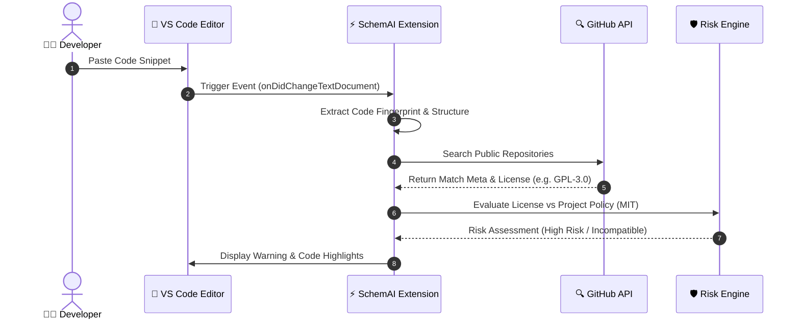
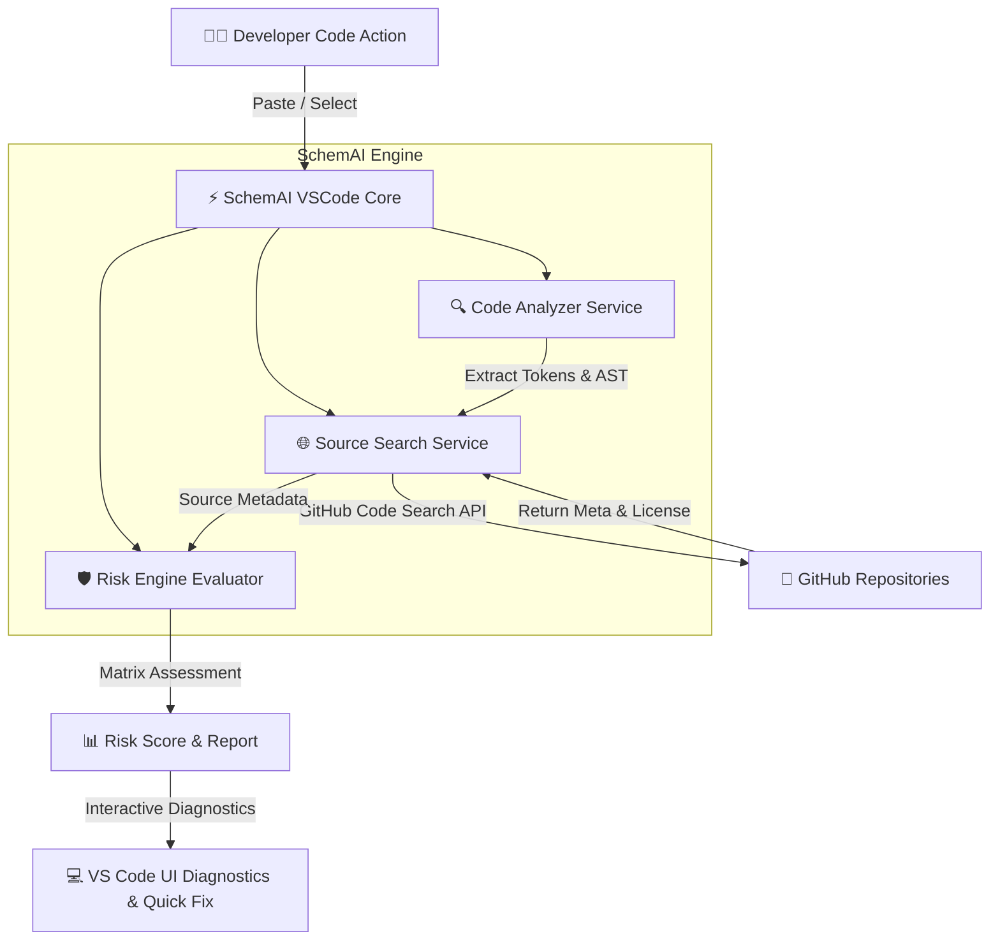

# SchemAI - Smart External Code & License Risk Analyzer

🌐 **Language / اللغة / Idioma:**  
[🇬🇧 English](README.md) | [🇦🇪 العربية](README_AR.md) | [🇪🇸 Español](README_ES.md)

---


## 🧰 Technology Stack & Ecosystem Compatibility

| Component / Spec | Version / Details | Status |
| :--- | :--- | :--- |
| **VS Code Engine** | `^1.75.0+` |  |
| **Runtime Environment** | Node.js `16.x` / `18.x` / `20.x` |  |
| **Language & Compiler** | TypeScript `^4.9.5` |  |
| **Testing Framework** | Mocha `^10.2.0` |  |
| **Packaging Tool** | VSCE `^4.0.0` |  |
| **CI/CD Automation** | GitHub Actions Workflow |  |
| **License** | MIT License |  |

### 🔤 Supported Programming Languages & Activation Triggers
The extension activates dynamically when working with any of the following languages:
* 🟨 **JavaScript** (`onLanguage:javascript`)
* 🟦 **TypeScript** (`onLanguage:typescript`)
* 🐍 **Python** (`onLanguage:python`)
* ☕ **Java** (`onLanguage:java`)
* 🟣 **C#** (`onLanguage:csharp`)
* 🐹 **Go** (`onLanguage:go`)
* ⚙️ **C++** (`onLanguage:cpp`)
* 🦀 **Rust** (`onLanguage:rust`)

---

## 📋 About SchemAI
**SchemAI** is a smart extension for **Visual Studio Code** designed to detect and analyze code pasted from external sources (such as GitHub or Stack Overflow), evaluating legal risk and license compatibility to protect software projects.

---

## 👥 SchemAI Team

* **Ahmet Asaad Hammoud**
* **Alexander Roldán Palomino**
* **David Vilaseca Pareja**
* **Abdul Rafey Hussain Parveen**
* **Sergio Bueno Gómez**
* **Suliman Mimon Youjili**
* **Leon Skalczynski**
* **Yunus Emre Köroğlu**
* **Yusuf Mahdy Mamdouh**

---

## 🖼️ UI & Visual Overview


---

## 📊 Architecture & Diagrams

### 1. Paste Detection & Analysis Workflow



---

### 2. System Architecture



---

### 3. License Compatibility Matrix

```mermaid
quadrantChart
    title Project License Compatibility Matrix
    x-axis Low Risk --> High Risk
    y-axis Low Restrictions --> High Restrictions (Copyleft)
    quadrant-1 ❌ Incompatible (Strict Copyleft - GPL)
    quadrant-2 ⚠️ Review Needed (Weak Copyleft - LGPL/MPL)
    quadrant-3 ✅ Fully Compatible (Permissive - MIT/Apache)
    quadrant-4 ℹ️ Attribution Required (BSD)
    MIT: [0.1, 0.2]
    Apache-2.0: [0.25, 0.3]
    BSD-3-Clause: [0.35, 0.4]
    LGPL-3.0: [0.65, 0.7]
    GPL-3.0: [0.9, 0.95]
```

---

## 🚀 Key Features
* **Automated Detection:** Instant scanning of pasted snippets directly inside the editor.
* **Source Matching:** Integration with public GitHub APIs to identify code origins.
* **Risk Evaluation:** Automatic comparison against target project licenses (e.g., MIT, Apache, GPL).
* **Interactive Alerts:** In-editor diagnostics and guidance for developer decisions.

---

## ⚙️ Building & Testing

### Run Unit Tests
```bash
npm test
```

### Package VSIX Extension
```bash
npm run package
```
