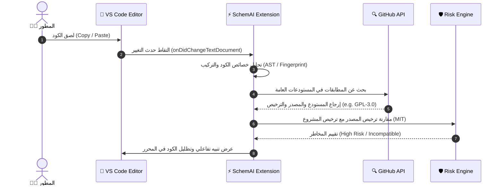
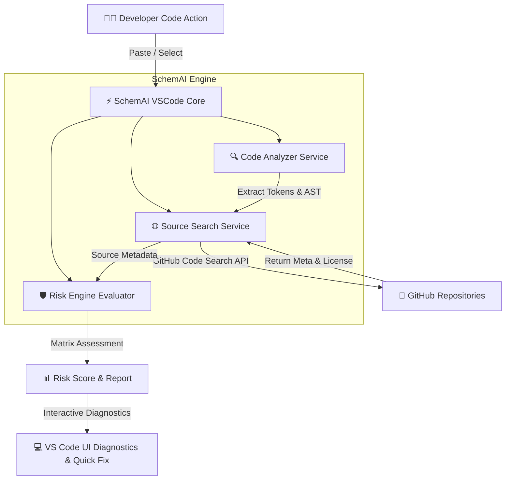

# SchemAI - Smart External Code & License Risk Analyzer

🌐 **Language / اللغة / Idioma:**  
[🇬🇧 English](README.md) | [🇦🇪 العربية](README_AR.md) | [🇪🇸 Español](README_ES.md)

---


## 🧰 التقنيات وبيئة التشغيل المدعومة (Tech Stack & Ecosystem)

| المكون / المواصفة | الإصدار / التفاصيل | الحالة |
| :--- | :--- | :--- |
| **مُحرك VS Code** | `^1.75.0+` |  |
| **بيئة التشغيل (Runtime)** | Node.js `16.x` / `18.x` / `20.x` |  |
| **اللغة والمترجم** | TypeScript `^4.9.5` |  |
| **إطار الاختبارات** | Mocha `^10.2.0` |  |
| **أداة التجميع** | VSCE `^4.0.0` |  |
| **الأتمتة والتكامل المستمر** | GitHub Actions Workflow |  |
| **الترخيص** | MIT License |  |

### 🔤 لغات البرمجة المدعومة وأحداث التفعيل
يعمل الامتداد تلقائياً فور كتابة أو لصق كود في أي من اللغات التالية:
* 🟨 **JavaScript** (`onLanguage:javascript`)
* 🟦 **TypeScript** (`onLanguage:typescript`)
* 🐍 **Python** (`onLanguage:python`)
* ☕ **Java** (`onLanguage:java`)
* 🟣 **C#** (`onLanguage:csharp`)
* 🐹 **Go** (`onLanguage:go`)
* ⚙️ **C++** (`onLanguage:cpp`)
* 🦀 **Rust** (`onLanguage:rust`)

---

## 📋 حول المشروع (About SchemAI)
**SchemAI** هو امتداد ذكي لبيئة **Visual Studio Code** يهدف إلى تحليل واكتشاف الكود البرمجي الذي يتم نسخه ولصقه من مصادر خارجية (مثل GitHub و Stack Overflow)، وتقييم المخاطر القانونية وتوافق التراخيص لحماية المشاريع البرمجية.

---

## 👥 فريق العمل (SchemAI Team)

* **Ahmet Asaad Hammoud**
* **Alexander Roldán Palomino**
* **David Vilaseca Pareja**
* **Abdul Rafey Hussain Parveen**
* **Sergio Bueno Gómez**
* **Suliman Mimon Youjili**
* **Leon Skalczynski**
* **Yunus Emre Köroğlu**
* **Yusuf Mahdy Mamdouh**

---

## 🖼️ واجهة الامتداد (UI & Visual Overview)


---

## 📊 دياجرامات ومخططات المعمارية (Architecture & Diagrams)

### 1. تدفق العمل الذكي عند اللصق (Paste Detection Workflow)



---

### 2. معمارية النظام (System Architecture)



---

### 3. مصفوفة توافق التراخيص (License Compatibility Matrix)

```mermaid
quadrantChart
    title مصفوفة توافق التراخيص للمشروع
    x-axis منخفض الخطورة --> مرتفع الخطورة
    y-axis قيود منخفضة --> قيود مرتفعة (Copyleft)
    quadrant-1 ❌ غير متوافق (Strict Copyleft - GPL)
    quadrant-2 ⚠️ يحتاج مراجعة (Weak Copyleft - LGPL/MPL)
    quadrant-3 ✅ متوافق كلياً (Permissive - MIT/Apache)
    quadrant-4 ℹ️ يحتاج نسب المصدر (Attribution - BSD)
    MIT: [0.1, 0.2]
    Apache-2.0: [0.25, 0.3]
    BSD-3-Clause: [0.35, 0.4]
    LGPL-3.0: [0.65, 0.7]
    GPL-3.0: [0.9, 0.95]
```

---

## 🚀 المميزات الرئيسية
* **اكتشاف تلقائي:** فحص الكود المنسوخ فوراً داخل المحرر.
* **البحث عن المصدر:** الربط مع مستودعات GitHub العامة لمطابقة المصدر.
* **تقييم المخاطر:** مقارنة ترخيص الكود المنسوخ مع ترخيص المشروع الحالي (مثل MIT, Apache, GPL).
* **تنبيهات تفاعلية:** عرض تفاصيل التراخيص والتوصيات المباشرة للمطور.

---

## ⚙️ التشغيل والاختبارات (Building & Testing)

### تشغيل وحدة الاختبارات (Unit Tests)
```bash
npm test
```

### تجميع الامتداد وبناء ملف `.vsix`
```bash
npm run package
```
