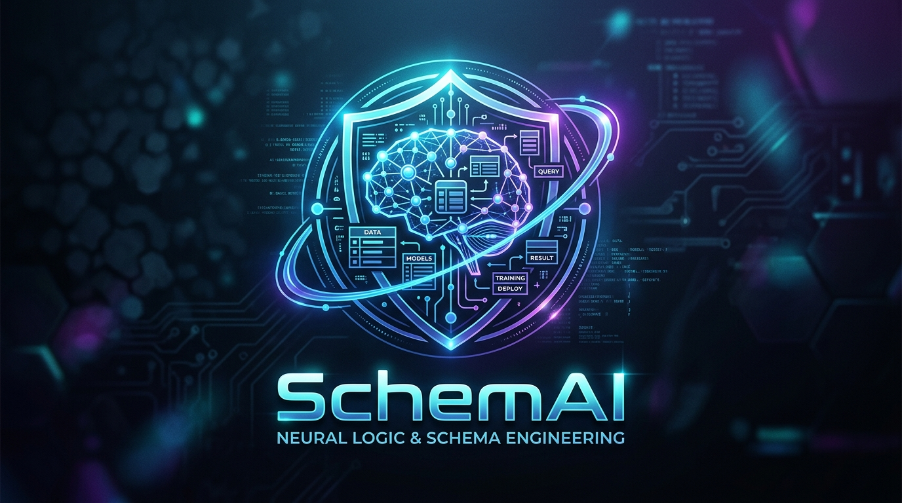
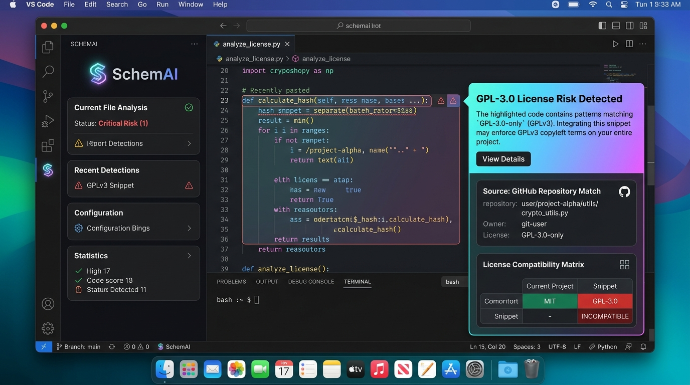
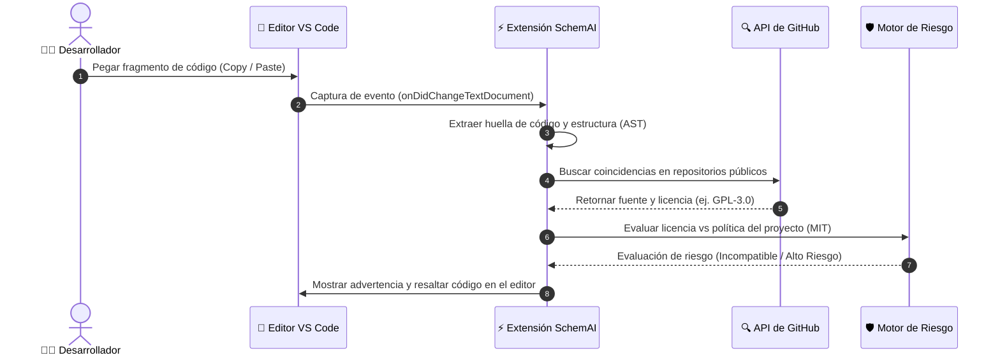
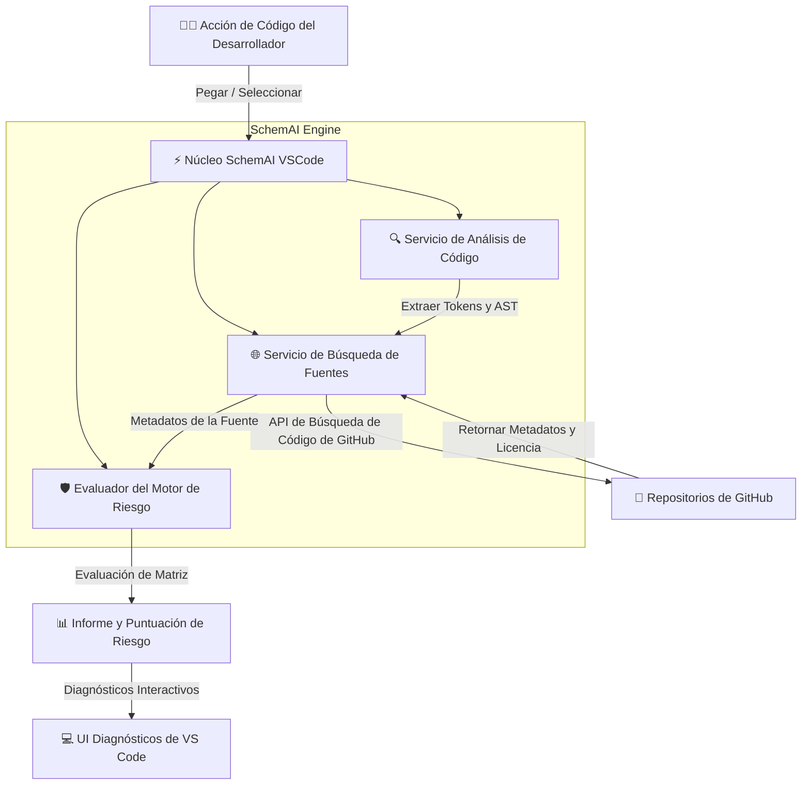

# SchemAI - Smart External Code & License Risk Analyzer

🌐 **Language / اللغة / Idioma:**  
[🇬🇧 English](README.md) | [🇦🇪 العربية](README_AR.md) | [🇪🇸 Español](README_ES.md)

---



## 🧰 Stack Tecnológico y Compatibilidad

| Componente / Especificación | Versión / Detalles | Estado |
| :--- | :--- | :--- |
| **Motor de VS Code** | `^1.75.0+` |  |
| **Entorno de Ejecución** | Node.js `16.x` / `18.x` / `20.x` |  |
| **Lenguaje y Compilador** | TypeScript `^4.9.5` |  |
| **Framework de Pruebas** | Mocha `^10.2.0` |  |
| **Herramienta de Empaquetado** | VSCE `^4.0.0` |  |
| **Automatización CI/CD** | Flujo GitHub Actions |  |
| **Licencia** | Licencia MIT |  |

### 🔤 Lenguajes de Programación Soportados y Disparadores
La extensión se activa dinámicamente al trabajar con cualquiera de los siguientes lenguajes:
* 🟨 **JavaScript** (`onLanguage:javascript`)
* 🟦 **TypeScript** (`onLanguage:typescript`)
* 🐍 **Python** (`onLanguage:python`)
* ☕ **Java** (`onLanguage:java`)
* 🟣 **C#** (`onLanguage:csharp`)
* 🐹 **Go** (`onLanguage:go`)
* ⚙️ **C++** (`onLanguage:cpp`)
* 🦀 **Rust** (`onLanguage:rust`)

---

## 📋 Sobre el Proyecto (About SchemAI)
**SchemAI** es una extensión inteligente para **Visual Studio Code** diseñada para detectar y analizar código pegado desde fuentes externas (como GitHub o Stack Overflow), evaluando el riesgo legal y la compatibilidad de licencias para proteger los proyectos de software.

---

## 👥 Equipo de Trabajo (SchemAI Team)

* **Ahmet Asaad Hammoud**
* **Alexander Roldán Palomino**
* **David Vilaseca Pareja**
* **Abdul Rafey Hussain Parveen**
* **Sergio Bueno Gómez**
* **Suliman Mimon Youjili**
* **Leon Skalczynski**
* **Yunus Emre Köroğlu**
* **Yusuf Mahdy Mamdouh**

---

## 🖼️ Interfaz de Usuario y Vista Previa (UI & Visual Overview)



---

## 📊 Arquitectura y Diagramas (Architecture & Diagrams)

### 1. Flujo de Detección de Código Pegado (Paste Detection Workflow)



---

### 2. Arquitectura del Sistema (System Architecture)



---

### 3. Matriz de Compatibilidad de Licencias (License Compatibility Matrix)

```mermaid
quadrantChart
    title Matriz de Compatibilidad de Licencias del Proyecto
    x-axis Riesgo Bajo --> Riesgo Alto
    y-axis Restricciones Bajas --> Restricciones Altas (Copyleft)
    quadrant-1 ❌ Incompatible (Strict Copyleft - GPL)
    quadrant-2 ⚠️ Requiere Revisión (Weak Copyleft - LGPL/MPL)
    quadrant-3 ✅ Totalmente Compatible (Permissive - MIT/Apache)
    quadrant-4 ℹ️ Requiere Atribución (BSD)
    MIT: [0.1, 0.2]
    Apache-2.0: [0.25, 0.3]
    BSD-3-Clause: [0.35, 0.4]
    LGPL-3.0: [0.65, 0.7]
    GPL-3.0: [0.9, 0.95]
```

---

## 🚀 Características Principales
* **Detección Automática:** Escaneo instantáneo de fragmentos pegados directamente en el editor.
* **Búsqueda de Fuentes:** Integración con la API pública de GitHub para identificar el origen del código.
* **Evaluación de Riesgos:** Comparación automática con las licencias del proyecto objetivo (ej. MIT, Apache, GPL).
* **Alertas Interactivas:** Diagnósticos integrados en el editor para guiar las decisiones del desarrollador.

---

## ⚙️ Compilación y Pruebas (Building & Testing)

### Ejecutar Pruebas Unitarias (Unit Tests)
```bash
npm test
```

### Compilar y Empaquetar Extensión (`.vsix`)
```bash
npm run package
```
